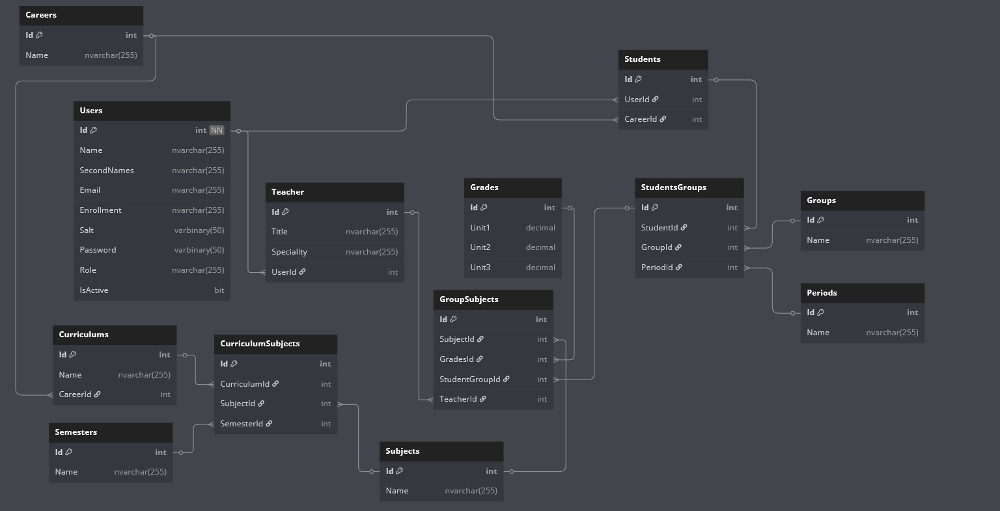

# 🎓 School_API 

API Rest para la gestion escolar que permite la autenticación de usuarios con diferentes roles (Alumnos, Docentes y Administradores), gestión de materias, calificaciones y periodos semestrales.

## 🚀 Tecnologías utilizadas

- ASP.NET Core 8
- Entity Framework Core
- SQL Server
- Unit of Work + Repository Pattern

## 📂 Estructura del proyecto

- `App`: Servicios de aplicación y lógica de negocio.
- `Core`: Entidades.
- `Infrastructure`: Implementaciones de repositorio y acceso a datos, middlewares y filtros.
- `Presentation`: Endpoints y configuración general de la API.

## 🔐 Autenticación

Autenticación basada en Json Web Token (JWT) con validacion de credenciales y control de acceso mediante roles de usuario.

## 🗃️ Diagrama de Base de Datos

